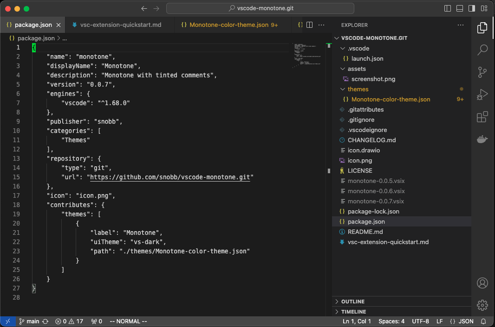

# Monotone colour theme

Simplistic monotone colour theme with tinted comments.


# Packaging

The theme is not published in the VSCode marketplace, but can be installed from the VSIX package file instead.

## Create the vscode package

```bash
$ npx @vscode/vsce package
```
